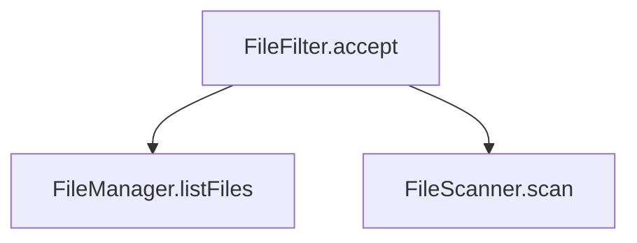

# CLAUDE.md

This file provides guidance to Claude Code (claude.ai/code) when working with code in this repository.

## 项目概述

SiliconMan (SMAN) 是一个基于 Claude Code 的智能代码分析和开发助手系统,采用前后端分离架构:
- **Agent (后端)**: Spring Boot 代码分析服务,提供 Spoon AST 分析、调用链分析、向量搜索等核心能力
- **IDE Plugin (前端)**: IntelliJ IDEA 插件,提供 IDE 内集成体验

**核心架构特点**:
- 使用 Claude Code CLI 作为 Agent 引擎,遵循三阶段工作流 (Analyze → Plan → Execute)
- Claude Code 通过 HTTP Tool API 调用后端工具,不直接访问文件系统
- IDE Plugin 通过 WebSocket 与后端通信,负责本地文件读写和 UI 渲染

详见: `docs/md/01-architecture.md`

---

## 常用开发命令

### Agent 后端 (Java 21+)

```bash
cd agent

# 构建项目
./gradlew build

# 运行测试
./gradlew test

# 运行单个测试类
./gradlew test --tests SpoonAstServiceTest

# 启动服务 (默认端口 8080)
./gradlew bootRun

# 或直接运行 JAR
java -jar build/libs/sman-agent-1.0.0.jar

# 健康检查
curl http://localhost:8080/api/test/health

# 查看 Claude Code 进程池状态
curl http://localhost:8080/api/claude-code/pool/status
```

**重要提示**: 后端服务需要以下依赖:
- Claude Code CLI (用于 Agent 编排)

### IDE Plugin (Kotlin 1.9.20)

```bash
cd ide-plugin

# 构建插件
./gradlew buildPlugin

# 在 IDEA 中运行插件 (开发模式)
./gradlew runIde

# 验证插件 (检查 plugin.xml 配置)
./gradlew verifyPlugin

# 发布插件到 JetBrains Marketplace
./gradlew publishPlugin
```

**生成的插件位置**: `ide-plugin/build/distributions/intellij-siliconman-*.zip`

---

## 代码架构

### 高层架构

```
IDE Plugin (Kotlin)
    ↓ WebSocket
Agent Backend (Java Spring Boot)
    ↓ HTTP Tool API
Claude Code CLI (Node.js)
    ↓ 调用工具
Agent Backend Tool Executors
```

**关键设计原则**:
1. **单一职责**: Claude Code 负责 Agent 编排,Agent 后端提供工具,IDE Plugin 负责 UI 和本地文件访问
2. **最小转化**: 对 Claude Code 的输入输出不做过多数据转换,直接透传
3. **统一线程池**: 所有异步操作使用统一的线程池管理

### Agent 后端核心包结构

```
agent/src/main/java/ai/smancode/sman/agent/
├── ast/              # Spoon AST 分析服务
│   └── SpoonAstService.java
├── callchain/        # 调用链分析服务
│   └── CallChainService.java
├── vector/           # 向量搜索服务 (BGE-M3 + Reranker)
│   └── VectorSearchService.java
├── claude/           # Claude Code 集成层
│   ├── ClaudeCodeProcessPool.java    # 进程管理器 (按需创建,支持多轮对话)
│   ├── QuickAnalysisController.java # 快速分析接口
│   ├── ClaudeCodeWorker.java         # Worker 封装
│   └── DedicatedWorkerPool.java      # 专属Worker池(备用)
├── models/           # 数据模型
│   ├── SpoonModels.java
│   ├── CallChainModels.java
│   └── WebSocketModels.java
└── SiliconManAgentApplication.java
```

**关键服务**:
- `SpoonAstService`: 使用 Spoon 11.0.0 进行 Java 代码结构分析
- `CallChainService`: 分析方法调用关系 (基于 Spoon AST + 正则匹配)
- `VectorSearchService`: 语义搜索代码 (基于 JVector 向量索引)
- `ClaudeCodeProcessPool`: 按需创建 Claude Code CLI 进程,支持多轮对话 (使用 `--resume` 参数)

### IDE Plugin 核心包结构

```
ide-plugin/src/main/kotlin/ai/smancode/sman/ide/
├── ui/               # UI 组件
│   ├── ChatPanel.kt           # 聊天面板
│   └── SiliconManToolWindow.java
├── service/          # 后端通信
│   ├── WebSocketClient.kt     # WebSocket 客户端
│   └── LocalFileService.kt    # 本地文件读写 (PSI API)
├── markdown/         # 渲染器
│   └── MarkdownRenderer.kt    # flexmark 渲染
└── SiliconManPlugin.kt        # 插件入口
```

---

## HTTP Tool API (Claude Code 调用接口)

Claude Code 通过 HTTP POST `/api/claude-code/tools/execute` 调用后端工具。

**可用工具列表**:

| 工具名 | 用途 | 参数示例 |
|--------|------|----------|
| `vector_search` | 向量语义搜索 | `{"query": "文件过滤", "top_k": 10}` |
| `read_class` | 读取 Java 类结构 | `{"className": "FileFilter", "mode": "structure"}` |
| `call_chain` | 调用链分析 | `{"method": "FileFilter.accept", "direction": "both", "depth": 2}` |
| `find_usages` | 查找引用 | `{"target": "FileFilter.accept", "maxResults": 30}` |
| `apply_change` | 应用代码修改 | `{"relativePath": "core/.../File.java", "searchContent": "...", "replaceContent": "..."}` |

**重要**: Claude Code **禁止**直接使用 Read/Edit 工具,所有操作必须通过 `http_tool` 调用后端 API。

详见: `docs/md/03-claude-code-integration.md`

---

## WebSocket API (IDE Plugin ↔ Agent Backend)

IDE Plugin 通过 WebSocket 与后端通信,默认端点: `ws://localhost:8080/ws/analyze`

**主要消息类型**:
- `ANALYZE`: IDE Plugin 发送分析请求
- `TOOL_CALL`: 后端转发工具调用给 IDE Plugin (如 read_class)
- `TOOL_RESULT`: IDE Plugin 返回工具执行结果
- `COMPLETE`: 后端推送分析完成结果

详见: `docs/md/02-websocket-api.md`

---

## 数据模型约定

### 代码分析结果模型

所有代码分析结果统一使用 Markdown 格式返回,包含:
- 类结构信息 (使用 Markdown 表格或代码块)
- 调用链关系 (使用 Mermaid 图表)
- 向量搜索结果 (使用带相关性分数的列表)

**示例格式**:
```markdown
## FileFilter.java

- **类名**: `FileFilter`
- **路径**: `core/src/.../FileFilter.java`
- **相关性**: 0.85

### 类结构

```java
public class FileFilter {
  private String pattern;

  public boolean accept(File file) {
    return file.getName().endsWith(pattern);
  }
}
```

### 调用关系


```

详见: `docs/md/04-data-models.md`

---

## 测试策略

### Agent 后端测试

- **单元测试**: 测试各 Service 的核心逻辑
  - `SpoonAstServiceTest`: AST 分析逻辑
  - `CallChainServiceTest`: 调用链分析逻辑
  - `VectorSearchServiceTest`: 向量搜索逻辑

- **集成测试**: 测试 Claude Code 工具调用流程
  - `ClaudeCodeToolControllerTest`: HTTP Tool API 端到端测试

**运行测试**:
```bash
cd agent
./gradlew test

# 查看测试报告
open build/reports/tests/test/index.html
```

### IDE Plugin 测试

插件测试主要依赖手动测试:
```bash
cd ide-plugin
./gradlew runIde
```

然后在测试 IDE 中:
1. 打开 SiliconMan 工具窗口
2. 发送测试请求
3. 验证 UI 渲染和工具执行结果

---

## Claude Code 工作流控制

Claude Code 的行为通过 `agent/data/claude-code-workspaces/worker-xxx/.claude/CLAUDE.md` 控制。

**关键规则**:
1. **三阶段工作流**: 必须遵守 Analyze → Plan → Execute 流程
2. **工具使用**: 禁止使用 Read/Edit,必须使用 `http_tool`
3. **语言**: 始终使用中文回答

**三阶段工作流示例**:
- **阶段一 (Analyze)**: 理解需求,调用 `vector_search` 搜索相关代码
- **阶段二 (Plan)**: 调用 `read_class` 和 `call_chain` 分析代码结构,制定修改方案
- **阶段三 (Execute)**: 调用 `apply_change` 应用修改

---

## 性能指标

| 指标 | 目标值 | 说明 |
|------|--------|------|
| 并发能力 | 10 个请求 | 由 Semaphore 并发控制决定 (默认 10) |
| 响应时间 | <5 秒 | 进程已启动的情况 |
| 向量搜索 | <2 秒 | JVector 向量索引查询时间 |
| 调用链分析 | <3 秒 | Spoon AST 解析 + 正则匹配时间 |
| 进程启动时间 | <3 秒 | 每次请求创建新进程 |

---

## 多轮对话机制

**核心原理**: 使用 Claude Code CLI 的 `--resume` 参数实现会话恢复

### 实现机制

1. **第一次请求**: 使用 `--session-id <UUID>` 创建新会话
2. **后续请求**: 检测会话文件存在,使用 `--resume <UUID>` 恢复会话
3. **会话文件**: 自动保存到 `~/.claude/projects/-<project-path>/<sessionId>.jsonl`
4. **上下文记忆**: CLI 自动加载历史消息 (通过 `parentUuid` 链)

### 关键代码

```java
// ClaudeCodeProcessPool.java
private boolean checkSessionExists(String sessionId) {
    // 检查会话文件是否存在
    File sessionFile = new File(
        System.getProperty("user.home"),
        ".claude/projects/" + projectPath + "/" + sessionId + ".jsonl"
    );
    return sessionFile.exists();
}

public ClaudeCodeWorker createWorker(String sessionId) throws IOException {
    boolean sessionExists = checkSessionExists(sessionId);

    ProcessBuilder pb;
    if (sessionExists) {
        // 会话已存在,使用 --resume 恢复
        pb = new ProcessBuilder(claudeCodePath, "--resume", sessionId, "--print");
    } else {
        // 新会话,使用 --session-id 创建
        pb = new ProcessBuilder(claudeCodePath, "--session-id", sessionId, "--print");
    }

    // 启动进程并返回 Worker
    // ...
}
```

### 测试方法

```bash
# 第1轮: 建立记忆
curl -X POST http://localhost:8080/api/analysis/chat \
  -H "Content-Type: application/json" \
  -d '{"message":"记住：我最喜欢的颜色是蓝色","projectKey":"test","sessionId":"8A7F9E2C..."}'

# 第2轮: 验证记忆
curl -X POST http://localhost:8080/api/analysis/chat \
  -H "Content-Type: application/json" \
  -d '{"message":"我最喜欢的颜色是什么？","projectKey":"test","sessionId":"8A7F9E2C..."}'

# ✅ 回复: "根据我们之前的对话，你最喜欢的颜色是蓝色。"
```

**优势**:
- ✅ 简单优雅: 利用 CLI 原生功能
- ✅ 资源高效: 按需创建进程,无需保持长连接
- ✅ 无锁定问题: 每次独立进程,避免 CLI 内部锁

详见: `docs/md/multi_turn.md`

---

## Claude Code 配置文件自动生成机制

### 核心原理

**ClaudeCodeProcessPool** 在服务启动时,会自动在 `agent/data/claude-code-workspaces/.claude/` 目录下创建 `CLAUDE.md` 配置文件。

#### 工作流程

```java
// ClaudeCodeProcessPool.java:77-97
private void prepareWorkDirectory() {
    File dir = new File(workDirBase);  // agent/data/claude-code-workspaces
    if (!dir.exists()) {
        dir.mkdirs();
    }

    // 创建 .claude 目录（所有worker共享）
    File claudeDir = new File(workDirBase, ".claude");
    if (!claudeDir.exists()) {
        claudeDir.mkdirs();
    }

    try {
        // 自动生成 CLAUDE.md（遵循 prompt_rules.md 规范）
        createClaudeConfig(claudeDir);
        // 自动生成 tools.json
        createToolsConfig(claudeDir);
    } catch (IOException e) {
        log.error("❌ 创建配置文件失败: {}", e.getMessage(), e);
    }
}
```

#### 生成的配置文件

| 文件 | 路径 | 用途 |
|------|------|------|
| `CLAUDE.md` | `agent/data/claude-code-workspaces/.claude/CLAUDE.md` | 控制 Claude Code 行为的核心提示词 |
| `tools.json` | `agent/data/claude-code-workspaces/.claude/tools.json` | 定义可用工具的 JSON Schema |

#### 配置内容特点

**1. 遵循 prompt_rules.md 规范**:
- ✅ 使用 `<system_config>` 标签定义语言规则
- ✅ 使用 `<thinking>` 标签强制英文思维链
- ✅ 使用中文视觉锚定（模板标题为中文）
- ✅ 使用 XML 标签包裹关键配置

**2. 包含 projectKey → projectPath 映射说明**:
```markdown
## Fallback Mode (降级模式说明)

### projectKey → projectPath 映射机制

**核心目的**: 当 Claude Code CLI 通过 HTTP Tool API 调用后端工具时,后端会自动根据 `projectKey` 注入 `projectPath`,确保工具能正确计算相对路径。
```

**3. 性能优化约束**:
- 🚨 禁止中途暂停
- 🚨 每次只读取一个文件
- 🚨 限制搜索结果数量 (limit ≤ 50)
- 🚨 优先使用 vector_search
- 🚨 大文件分段读取

#### 配置更新机制

**当前实现**: 配置文件在服务启动时一次性生成

**更新方式**:
1. **重启服务**: 删除旧的 `.claude/CLAUDE.md`,重启服务自动生成新版本
2. **修改代码**: 编辑 `ClaudeCodeProcessPool.createClaudeConfig()` 方法

**为什么自动生成?**
- ✅ **版本控制**: 配置内容与代码版本同步,避免配置漂移
- ✅ **统一管理**: 所有 Worker 进程共享同一份配置
- ✅ **动态调整**: 可以根据环境变量动态调整配置内容

#### 验证方法

```bash
# 1. 启动服务
cd agent
./gradlew bootRun

# 2. 检查配置文件是否生成
ls -lh data/claude-code-workspaces/.claude/

# 3. 查看生成的配置内容
cat data/claude-code-workspaces/.claude/CLAUDE.md

# 4. 验证是否符合 prompt_rules.md 规范
grep -E "<system_config>|<thinking>|<anti_hallucination_rules>" data/claude-code-workspaces/.claude/CLAUDE.md
```

#### 配置文件示例

**生成的 CLAUDE.md 片段**:
```markdown
# System Configuration
<system_config>
    <language_rule>
        <input_processing>English (For logic & reasoning)</input_processing>
        <final_output>Simplified Chinese (For user readability)</final_output>
    </language_rule>
    <tool_usage>
        <forbidden_tools>Read, Edit, Bash, Write</forbidden_tools>
        <required_tool>http_tool</required_tool>
    </tool_usage>
</system_config>

## Available Tools (Priority Order)

### 1. vector_search ⭐ **PREFERRED** (Fastest: ~10 seconds)
http_tool("vector_search", {
    "query": "文件过滤",
    "projectKey": "${PROJECT_KEY}",
    "top_k": 10
})
```

---

## 降级模式配置 (Fallback Mode)

### projectKey → projectPath 映射机制

**核心目的**: 在降级模式下 (Claude Code CLI 不可用时),通过 `projectKey` 自动查询服务器上的源码路径 (`projectPath`),确保工具能正确计算相对路径。

#### 配置格式

在 `application.yml` 中配置映射关系:

```yaml
agent:
  projects:
    autoloop:
      project-path: /Users/liuchao/projects/autoloop
      description: "AutoLoop 项目"
      language: "java"
      version: "1.0.0"

    # 示例：银行核心系统
    # bank-core:
    #   project-path: /Users/user/projects/bank-core
    #   description: "银行核心系统"
    #   language: "java"
    #   version: "1.0.0"
```

#### 使用场景

| 场景 | 查询时机 | 查询位置 | 用途 |
|------|----------|----------|------|
| **正常模式** | WebSocket 连接建立时 | `AgentWebSocketHandler.afterConnectionEstablished()` | 将 `projectPath` 传递给 Claude Code |
| **降级模式** | 处理请求时 | `FallbackOrchestrator.processRequest()` | 工具计算相对路径 |

#### 实现细节

**1. PathUtils (路径工具类)**

统一的路径处理工具类，支持跨平台路径转换：

```java
// 自动检测环境并转换路径
String normalizedPath = PathUtils.normalizePath("C:\\Users\\projects\\autoloop");
// Windows Git Bash: /c/Users/projects/autoloop
// Linux/Mac: /Users/projects/autoloop (不变)

// 手动转换 Windows → Git Bash
String gitBashPath = PathUtils.convertToGitBashPath("C:\\Users\\projects");
// 结果: /c/Users/projects

// 手动转换 Git Bash → Windows
String windowsPath = PathUtils.convertToWindowsPath("/c/Users/projects");
// 结果: C:\\Users\\projects

// 判断路径类型
boolean isWindows = PathUtils.isWindowsPath("C:\\path"); // true
boolean isGitBash = PathUtils.isGitBashPath("/c/path"); // true

// 获取当前环境类型
PathUtils.PathType type = PathUtils.getCurrentPathType();
// 返回: WINDOWS, GIT_BASH, 或 UNIX
```

**2. ProjectConfigService (配置服务)**

```java
@Service
@ConfigurationProperties(prefix = "agent")
public class ProjectConfigService {
    private Map<String, ProjectConfig> projects;

    public String getProjectPath(String projectKey) {
        ProjectConfig config = projects.get(projectKey);
        if (config == null) {
            throw new IllegalArgumentException(
                "未找到 projectKey 映射: " + projectKey
            );
        }
        // 自动调用 PathUtils 规范化路径
        String originalPath = config.getProjectPath();
        return PathUtils.normalizePath(originalPath);
    }
}
```

**2. FallbackOrchestrator (降级编排器)**

```java
@Component
public class FallbackOrchestrator {
    @Autowired
    private ProjectConfigService projectConfigService;

    public String processRequest(String userMessage, String projectKey, String sessionId) {
        // 关键步骤: 查询 projectPath
        String projectPath = projectConfigService.getProjectPath(projectKey);
        log.info("📋 查询到 projectPath: {}", projectPath);

        // 传递给工具执行
        String result = executeTool(intent, userMessage, projectKey, projectPath);
        // ...
    }
}
```

**3. HttpToolExecutor (HTTP 工具执行器)**

```java
@Component
public class HttpToolExecutor {
    @Autowired
    private ProjectConfigService projectConfigService;

    public ToolExecutionResponse execute(String toolName, Map<String, Object> params,
                                         String projectKey, String sessionId) {
        // 自动注入 projectPath (如果提供了 projectKey)
        if (projectKey != null && !params.containsKey("projectPath")) {
            String projectPath = projectConfigService.getProjectPath(projectKey);
            params.put("projectPath", projectPath);
        }

        // 执行具体工具
        // ...
    }
}
```

#### 错误处理

当 `projectKey` 未配置时:

1. **抛出异常**: `IllegalArgumentException: 未找到 projectKey 映射: xxx`
2. **友好提示**: 列出所有可用的 `projectKeys`
3. **日志记录**: `log.error("❌ projectKey 映射未找到: projectKey={}", projectKey)`

**错误响应示例**:
```markdown
## ⚠️ 降级模式提示

当前系统运行在**降级模式**，处理请求时发生错误。

---

### ❌ 错误信息

```
未找到 projectKey 映射: unknown-project
请检查 application.yml 中的 agent.projects 配置
可用的 projectKeys: [autoloop]
```

---

### 📋 可用的 projectKeys

- `autoloop`

请检查 `application.yml` 中的 `agent.projects` 配置。
```

#### 环境变量支持

使用环境变量覆盖配置 (适用于生产环境):

```bash
# 方式1: 完整配置
export AUTOLOOP_PROJECT_PATH="/path/to/autoloop"

# 方式2: 使用 Spring Boot 外部配置
java -jar sman-agent.jar --agent.projects.autoloop.project-path=/path/to/autoloop
```

#### Windows Git Bash 支持

**PathUtils** 自动处理 Windows 路径转换：

| 原始路径 (Windows) | 转换后 (Git Bash) | 说明 |
|-------------------|-------------------|------|
| `C:\Users\projects\autoloop` | `/c/Users/projects/autoloop` | 盘符转小写，反斜杠转正斜杠 |
| `D:\data\app` | `/d/data/app` | 支持任意盘符 |
| `/c/Users/projects` | `/c/Users/projects` | 已是 Git Bash 格式，不转换 |

**环境检测**:
- 通过 `System.getProperty("os.name")` 检测操作系统
- 通过环境变量 `MSYSTEM` 检测 Git Bash 环境
- 非 Windows 系统不做转换

**配置示例** (application.yml):
```yaml
agent:
  projects:
    autoloop:
      # Windows 原生路径配置
      project-path: C:\\Users\\projects\\autoloop
      # 或 Git Bash 路径配置（二选一）
      # project-path: /c/Users/projects/autoloop
      description: "AutoLoop 项目"
      language: "java"
```

**推荐做法**:
- ✅ 在 `application.yml` 中使用**原生路径格式**（Windows 用反斜杠，Linux/Mac 用正斜杠）
- ✅ 让 `PathUtils` 自动处理环境适配
- ❌ 避免硬编码特定环境的路径格式

#### 验证方法

```bash
# 1. 检查配置是否加载成功
curl http://localhost:8080/api/config/projects

# 2. 测试降级模式
curl -X POST http://localhost:8080/api/fallback/test \
  -H "Content-Type: application/json" \
  -d '{"message":"搜索文件过滤代码","projectKey":"autoloop"}'

# 3. 查看日志确认 projectPath 查询
tail -f logs/app.log | grep "查询到 projectPath"
```

---

## 故障排查

### 后端启动失败

**症状**: `./gradlew bootRun` 报错

**排查步骤**:
1. 检查 Java 版本: `java -version` (需要 21+)
2. 检查端口 8080 是否被占用: `lsof -i :8080`
3. 查看日志: `agent/logs/sman-agent.log`

### Claude Code 工具调用失败

**症状**: HTTP Tool API 返回 500 错误

**排查步骤**:
1. 检查进程池状态: `curl http://localhost:8080/api/claude-code/pool/status`
2. 检查工具名称和参数是否正确
3. 查看后端日志中的工具执行错误信息

### IDE Plugin 连接失败

**症状**: WebSocket 连接超时

**排查步骤**:
1. 检查后端是否运行: `curl http://localhost:8080/api/test/health`
2. 检查防火墙设置
3. 在 IDE Plugin 设置中确认服务器 URL 配置正确

---

## 依赖版本

### Agent 后端
- Java 21
- Spring Boot 3.2.5
- Spoon 11.0.0
- JVector 3.0.6
- H2 Database 2.2.224
- OkHttp 4.12.0

### IDE Plugin
- Kotlin 1.9.20
- IntelliJ Platform 2024.1+
- flexmark-java 0.64.8
- OkHttp 4.12.0

---

## 相关文档

- [架构设计](docs/md/01-architecture.md) - 总体架构和设计决策
- [WebSocket API](docs/md/02-websocket-api.md) - IDE Plugin 通信协议
- [Claude Code 集成](docs/md/03-claude-code-integration.md) - HTTP Tool API 规范
- [数据模型](docs/md/04-data-models.md) - 数据结构定义
- [后端详细文档](agent/README.md) - Agent 模块说明
- [插件使用指南](ide-plugin/README.md) - IDE Plugin 安装和使用
