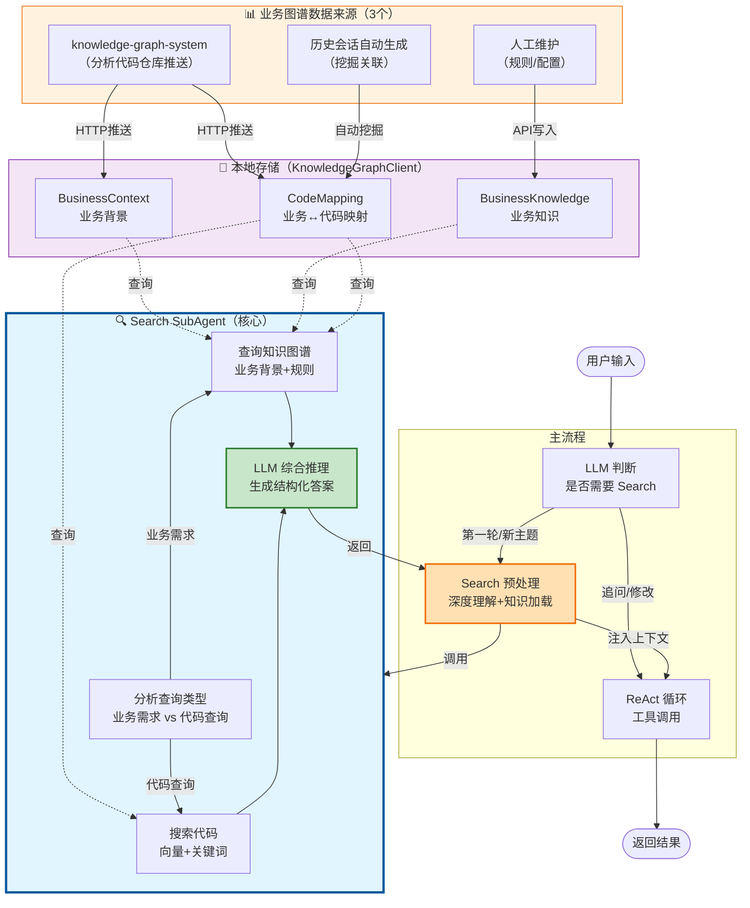
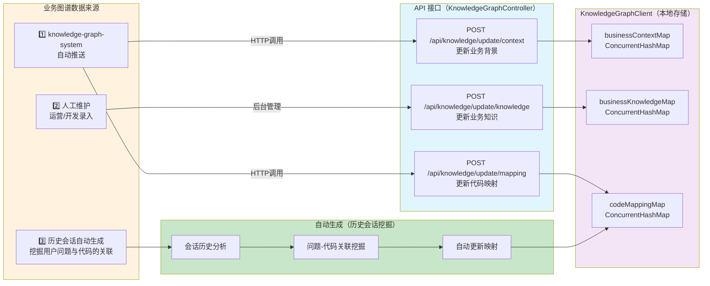
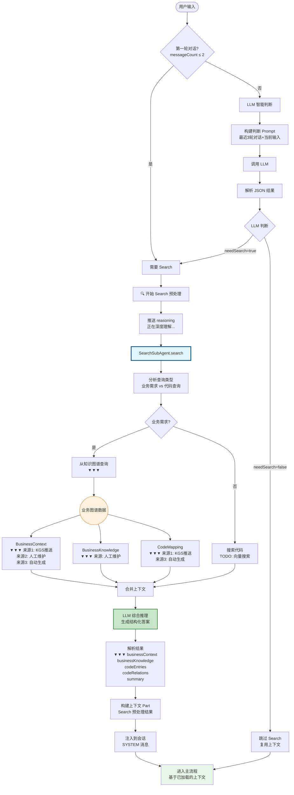
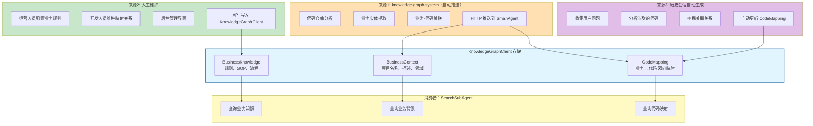
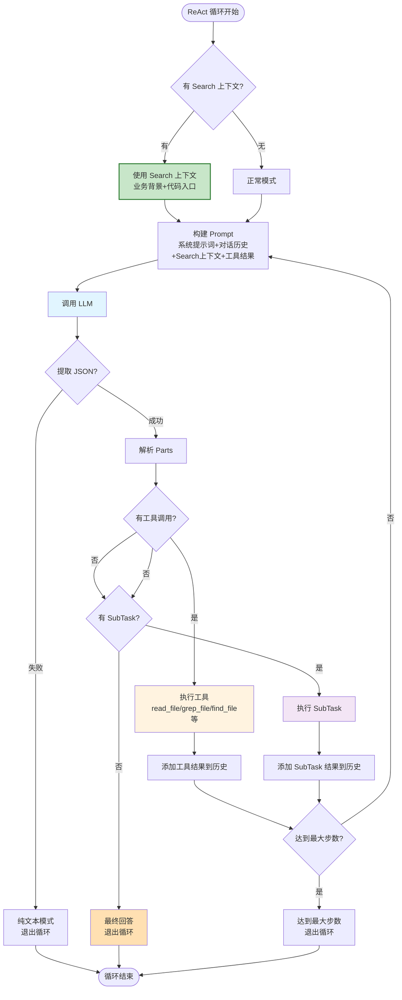

# SmanAgent 完整流程图

## 整体架构流程（突出 Search 的核心作用）



## Search 数据来源详解



## Search 预处理完整流程（突出数据来源）



## 数据来源详细说明



## 完整对话流程（含数据来源）

```mermaid
sequenceDiagram
    participant User as 用户
    participant Loop as SmanAgentLoop
    participant Judge as Search判断 LLM
    participant Search as SearchSubAgent
    participant KG as KnowledgeGraphClient
    participant Main as 主 LLM

    %% 数据来源说明
    Note over KG: 数据来源：<br/>1. knowledge-graph-system<br/>2. 人工维护<br/>3. 历史会话自动生成

    %% 第一轮对话
    User->>Loop: "520提额添加客户经理浮层提示"
    Loop->>Loop: messageCount=1 ≤ 2
    Loop->>Search: 执行 Search 预处理

    Search->>KG: 查询业务背景
    KG-->>Search: BusinessContext<br/>（来源：KGS推送）
    Search->>KG: 查询业务知识
    KG-->>Search: BusinessKnowledge<br/>（来源：人工维护）
    Search->>KG: 查询代码映射
    KG-->>Search: CodeMapping<br/>（来源：KGS推送+自动生成）

    Search->>Search: LLM 综合推理
    Search-->>Loop: Search 结果

    Loop->>Loop: 注入到会话（SYSTEM 消息）
    Loop->>Main: 进入主循环

    Main->>Main: 基于 Search 上下文规划
    Main-->>Loop: 返回方案
    Loop-->>User: 方案结果

    %% 第二轮对话
    User->>Loop: "把浮层颜色改成红色"
    Loop->>Judge: LLM 判断是否 Search
    Judge->>Judge: 分析对话历史+当前输入
    Judge-->>Loop: needSearch=false<br/>reason: 追问模式
    Loop->>Loop: 跳过 Search
    Loop->>Main: 直接进入主循环
    Main->>Main: 基于已有上下文处理
    Main-->>Loop: 修改完成
    Loop-->>User: 修改结果

    %% 自动生成环节
    Note over KG: 会话结束后<br/>自动挖掘关联<br/>更新 CodeMapping

    style Search fill:#e1f5ff,stroke:#01579b,stroke-width:2px
    style KG fill:#fff3e0,stroke:#ef6c00
```

## 主循环 ReAct 流程（Search 预处理后）



## 关键设计决策

| 决策点 | 方案 | 理由 |
|--------|------|------|
| **Search 触发** | LLM 判断 | 避免硬编码，智能识别新主题 vs 追问 |
| **第一轮对话** | 必定 Search | 需要加载业务背景和代码入口 |
| **追问/修改** | 跳过 Search | 复用已有上下文，提高效率 |
| **数据来源1** | KGS 自动推送 | 代码分析自动化，减少人工维护 |
| **数据来源2** | 人工维护 | 业务规则需要专家配置 |
| **数据来源3** | 历史会话生成 | 持续优化映射关系 |
| **数据存储** | 内存占位符 | 后续替换为数据库持久化 |

