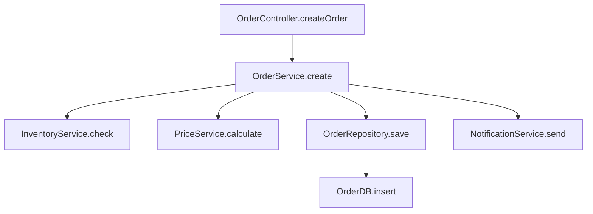

# 核心能力：自迭代项目理解系统

> 这是 SmanCode 最核心的能力，没有之一
> 日期：2026-02-23

---

## 一、核心问题

### 1.1 当前困境

**业界现状**：用 Skill 封装常见业务场景

```
用户需求 → 匹配 Skill → 执行 Skill 内置流程 → 完成任务
```

**问题**：
1. Skill 需要人工编写和维护
2. 新项目/新业务场景没有对应 Skill
3. Skill 无法自动适应项目变化

**我们的目标**：
```
项目代码 → Agent 自主理解 → 生成项目专属知识 → 持续迭代完善
```

### 1.2 核心挑战

| 挑战 | 描述 |
|------|------|
| **如何理解** | Agent 如何从代码中提取业务语义？ |
| **如何组织** | 提取的知识如何结构化存储？ |
| **如何迭代** | 如何持续完善而不是一次性分析？ |
| **如何利用** | 存储的知识如何在后续任务中使用？ |

---

## 二、设计理念：项目拼图

### 2.1 核心比喻

把项目理解看作**拼图游戏**：

```
┌─────────────────────────────────────────────────────────────┐
│                        项目拼图                              │
│  ┌─────┐ ┌─────┐ ┌─────┐ ┌─────┐                           │
│  │ API │ │ DB  │ │业务流│ │ ??? │  ← 已拼好的部分          │
│  └─────┘ └─────┘ └─────┘ └─────┘                           │
│  ┌─────┐ ┌─────┐ ┌─────┐ ┌─────┐                           │
│  │配置 │ │依赖 │ │ ??? │ │ ??? │  ← 未知的空白             │
│  └─────┘ └─────┘ └─────┘ └─────┘                           │
│                                                             │
│  Agent 在后台持续工作，一块一块地填充拼图                     │
└─────────────────────────────────────────────────────────────┘
```

### 2.2 拼图块类型

| 拼图块 | 描述 | 输出 |
|--------|------|------|
| **结构拼图** | 项目结构、模块划分 | `PROJECT_STRUCTURE.md` |
| **技术拼图** | 技术栈、依赖关系 | `TECH_STACK.md` |
| **入口拼图** | API 入口、调用入口 | `API_ENTRIES.md` |
| **数据拼图** | 数据模型、表关系 | `DB_ENTITIES.md` + ER 图 |
| **流程拼图** | 业务流程、调用链 | `FLOW_*.md` + 流程图 |
| **规则拼图** | 业务规则、约束条件 | `RULES.md` |
| **概念拼图** | 领域概念、术语表 | `GLOSSARY.md` |

### 2.3 拼图完成度

```
完成度 = 已拼块数 / 总块数 × 质量系数

质量系数 = (置信度 × 覆盖率 × 新鲜度) / 3

- 置信度：Agent 对分析结果的确信程度 (0-1)
- 覆盖率：分析覆盖的代码比例 (0-1)
- 新鲜度：分析结果的时间衰减 (1 → 0)
```

---

## 三、自迭代机制设计

### 3.1 迭代循环

```
┌──────────────────────────────────────────────────────────────┐
│                     自迭代循环                                │
│                                                              │
│   ┌──────────┐                                              │
│   │  休眠    │ ←───── 无变更时休眠                           │
│   └────┬─────┘                                              │
│        │ 文件变更 / 定时唤醒                                  │
│        ▼                                                     │
│   ┌──────────┐                                              │
│   │ 发现空白 │ ←───── 检查哪些拼图块缺失或过时               │
│   └────┬─────┘                                              │
│        │                                                     │
│        ▼                                                     │
│   ┌──────────┐                                              │
│   │ 选择任务 │ ←───── 优先级排序：高价值 + 低成本            │
│   └────┬─────┘                                              │
│        │                                                     │
│        ▼                                                     │
│   ┌──────────┐                                              │
│   │ 执行分析 │ ←───── 调用 LLM + 工具                        │
│   └────┬─────┘                                              │
│        │                                                     │
│        ▼                                                     │
│   ┌──────────┐                                              │
│   │ 验证结果 │ ←───── 完整度检查 + 交叉验证                  │
│   └────┬─────┘                                              │
│        │                                                     │
│        ▼                                                     │
│   ┌──────────┐                                              │
│   │ 更新拼图 │ ←───── 写入 Markdown + 更新向量索引           │
│   └────┬─────┘                                              │
│        │                                                     │
│        ▼                                                     │
│   ┌──────────┐                                              │
│   │ 发现新空白│ ←───── 分析完成后可能发现新的未知区域        │
│   └────┬─────┘                                              │
│        │                                                     │
│        └──────────────────────────────────────┐             │
│                                               │             │
└───────────────────────────────────────────────┼─────────────┘
                                                │
                                                ▼
                                          回到选择任务
```

### 3.2 空白发现机制

**方式一：文件变更触发**

```kotlin
// 文件变更 → 影响分析 → 发现需要更新的拼图块
fileChanged(path) → analyzeImpact(path) → affectedPuzzlePieces(path)

// 例如：新增 OrderController.java
// → 可能需要更新 API_ENTRIES.md
// → 可能需要更新 FLOW_ORDER.md（如果存在）
// → 可能需要新增 FLOW_ORDER.md（如果不存在）
```

**方式二：交叉验证发现**

```kotlin
// 比对不同分析结果，发现不一致
apiEntry.method = "createOrder"  // API 入口分析结果
flowEntry.calls = ["orderService.submit()"]  // 流程分析结果

// 不一致：API 说 createOrder，流程说 submit
// → 标记为需要重新分析
```

**方式三：引用追踪发现**

```kotlin
// 分析 A 时发现引用了 B，但 B 未被分析
analyzeClass("OrderService")
  → calls "PaymentService.process()"
  → PaymentService 未分析
  → 添加到待分析队列
```

**方式四：用户任务触发**

```kotlin
// 用户提问时，发现相关知识缺失
user asks: "订单退款流程是怎样的？"
  → search("退款流程") → no results
  → 标记 "退款流程" 为空白
  → 触发实时分析
```

### 3.3 优先级排序

```kotlin
data class AnalysisTask(
    val puzzlePiece: PuzzlePiece,
    val priority: Double,  // 0-1，越高越优先
    val cost: Double,      // 预估 Token 消耗
    val value: Double      // 预估知识价值
)

fun calculatePriority(task: AnalysisTask): Double {
    // 价值 / 成本比
    val roi = task.value / task.cost

    // 新鲜度衰减
    val freshness = calculateFreshness(task.puzzlePiece.lastUpdated)

    // 用户关注热度（近期是否被查询）
    val heat = calculateHeat(task.puzzlePiece.queryCount)

    return roi * 0.5 + freshness * 0.3 + heat * 0.2
}
```

### 3.4 任务执行策略

**策略一：后台静默执行**

```kotlin
// 低优先级任务，后台执行，不打扰用户
backgroundExecutor.submit(task) {
    // 低频执行（每 5 分钟一个任务）
    // 低 Token 预算（每次 < 10k tokens）
    // 结果静默写入 Markdown
}
```

**策略二：用户触发执行**

```kotlin
// 高优先级任务，用户触发时执行
userTrigger(task) {
    // 立即执行
    // 高 Token 预算（可达 50k tokens）
    // 结果展示给用户确认
}
```

**策略三：批量执行**

```kotlin
// 夜间/空闲时批量执行
batchExecutor.submit(tasks) {
    // 整理所有待执行任务
    // 合并相似任务
    // 批量执行，复用 LLM 调用
}
```

---

## 四、知识存储结构

### 4.1 目录设计

```
{projectPath}/.sman/
├── MEMORY.md                    # 项目记忆（用户可见可编辑）
│
├── puzzles/                     # 拼图块存储
│   ├── status.json              # 拼图状态汇总
│   │
│   ├── structure/               # 结构拼图
│   │   └── PROJECT_STRUCTURE.md
│   │
│   ├── tech/                    # 技术拼图
│   │   └── TECH_STACK.md
│   │
│   ├── api/                     # 入口拼图
│   │   ├── API_ENTRIES.md
│   │   └── api-detail/          # API 详情
│   │       ├── UserController.md
│   │       └── OrderController.md
│   │
│   ├── data/                    # 数据拼图
│   │   ├── DB_ENTITIES.md
│   │   ├── ER_DIAGRAM.md
│   │   └── entity-detail/
│   │       ├── User.md
│   │       └── Order.md
│   │
│   ├── flow/                    # 流程拼图（核心）
│   │   ├── FLOWS_INDEX.md       # 流程索引
│   │   ├── FLOW_USER_REGISTER.md
│   │   ├── FLOW_ORDER_CREATE.md
│   │   └── FLOW_PAYMENT.md
│   │
│   ├── rules/                   # 规则拼图
│   │   └── BUSINESS_RULES.md
│   │
│   └── concepts/                # 概念拼图
│       └── GLOSSARY.md
│
├── queue/                       # 任务队列
│   ├── pending.json             # 待执行任务
│   └── history.json             # 执行历史
│
└── cache/                       # 缓存（不入 Git）
    ├── md5.json                 # MD5 缓存
    └── vectors/                 # 向量索引
```

### 4.2 拼图状态文件

```json
// puzzles/status.json
{
  "lastUpdated": "2026-02-23T10:30:00Z",
  "overallCompleteness": 0.65,
  "pieces": {
    "PROJECT_STRUCTURE": {
      "status": "COMPLETED",
      "completeness": 0.95,
      "confidence": 0.9,
      "lastUpdated": "2026-02-22T15:00:00Z",
      "fileCount": 120,
      "analyzedCount": 114
    },
    "TECH_STACK": {
      "status": "COMPLETED",
      "completeness": 0.9,
      "confidence": 0.95,
      "lastUpdated": "2026-02-22T15:30:00Z"
    },
    "API_ENTRIES": {
      "status": "COMPLETED",
      "completeness": 0.8,
      "confidence": 0.85,
      "lastUpdated": "2026-02-23T09:00:00Z",
      "totalApis": 45,
      "analyzedApis": 38
    },
    "FLOW_ORDER_CREATE": {
      "status": "IN_PROGRESS",
      "completeness": 0.3,
      "confidence": 0.5,
      "lastUpdated": "2026-02-23T10:00:00Z",
      "pendingSteps": ["调用链分析", "异常处理流程"]
    },
    "FLOW_PAYMENT": {
      "status": "PENDING",
      "completeness": 0,
      "confidence": 0,
      "discoveredAt": "2026-02-23T10:30:00Z",
      "trigger": "用户查询触发"
    }
  }
}
```

### 4.3 流程拼图文件格式

```markdown
# 业务流程：订单创建

---
puzzleType: FLOW
completeness: 0.8
confidence: 0.85
lastUpdated: 2026-02-23T10:00:00Z
trigger: API 分析发现 OrderController.createOrder()
---

## 流程概述

用户提交订单的完整业务流程，从请求入口到数据持久化。

## 入口

- **Controller**: `OrderController.createOrder()`
- **HTTP**: `POST /api/orders`
- **权限**: 需要登录

## 调用链



## 核心类

| 类 | 职责 | 文件路径 |
|---|------|---------|
| OrderController | 接收请求，参数校验 | controller/OrderController.java |
| OrderService | 业务逻辑编排 | service/OrderService.java |
| OrderRepository | 数据持久化 | repository/OrderRepository.java |

## 业务规则

1. **库存校验**：创建订单前必须校验库存充足
2. **价格计算**：使用 PriceService 计算，考虑优惠和运费
3. **幂等性**：同一用户 5 分钟内不能创建相同订单

## 异常流程

| 场景 | 处理 |
|------|------|
| 库存不足 | 抛出 InsufficientInventoryException，返回 400 |
| 价格计算失败 | 记录日志，返回 500 |
| 数据库写入失败 | 事务回滚，返回 500 |

## 待补充

- [ ] 支付回调流程
- [ ] 订单状态机
- [ ] 取消订单流程
```

---

## 五、知识利用机制

### 5.1 上下文注入

```kotlin
class PuzzleContextInjector {
    /**
     * 根据用户问题注入相关拼图块
     */
    fun injectContext(userQuery: String): String {
        // 1. 语义搜索相关拼图
        val relatedPuzzles = searchRelatedPuzzles(userQuery, topK = 5)

        // 2. 构建上下文
        return buildString {
            append("## 项目知识\n\n")

            relatedPuzzles.forEach { puzzle ->
                append("### ${puzzle.title}\n\n")
                append(puzzle.summary)  // 摘要，不是全文
                append("\n\n")
                append("详细信息见: ${puzzle.path}\n\n")
            }

            append("---\n\n")
            append("*以上信息来自项目自动分析，如有疑问请查阅原始文件。*\n")
        }
    }
}
```

### 5.2 动态加载

```kotlin
class PuzzleLoader {
    /**
     * 按需加载完整拼图内容
     */
    suspend fun loadPuzzle(puzzleId: String): PuzzleContent {
        val puzzle = puzzleStore.get(puzzleId)

        // 检查新鲜度
        if (puzzle.isStale()) {
            // 触发后台更新
            backgroundUpdater.schedule(puzzleId)
        }

        return puzzle.content
    }

    /**
     * 加载流程完整调用链
     */
    suspend fun loadFlowChain(flowId: String): FlowChain {
        val flow = loadPuzzle(flowId)

        // 递归加载子流程
        val subFlows = flow.referencedFlows.map { loadPuzzle(it) }

        return FlowChain(flow, subFlows)
    }
}
```

### 5.3 查询加速

```kotlin
class PuzzleSearchService {
    /**
     * 语义搜索拼图内容
     */
    suspend fun search(query: String, limit: Int = 10): List<SearchResult> {
        // BGE-M3 向量搜索
        val vectorResults = vectorStore.search(query, topK = limit * 2)

        // BM25 关键词搜索
        val keywordResults = bm25Index.search(query, topK = limit * 2)

        // 混合排序
        return hybridMerge(vectorResults, keywordResults, limit)
    }
}
```

---

## 六、与 Skill 系统的关系

### 6.1 核心区别

| 维度 | 传统 Skill | 自迭代拼图 |
|------|-----------|-----------|
| **来源** | 人工编写 | Agent 自动生成 |
| **适应性** | 通用模板 | 项目专属 |
| **更新** | 手动发布 | 自动迭代 |
| **质量** | 取决于编写者 | 取决于 Agent 能力 |
| **覆盖** | 有限场景 | 理论上全覆盖 |

### 6.2 协同模式

```
┌─────────────────────────────────────────────────────────────┐
│                    Skill + 拼图 协同                         │
├─────────────────────────────────────────────────────────────┤
│                                                             │
│   通用知识（Skill）        项目专属知识（拼图）               │
│   ┌─────────────┐         ┌─────────────────────┐          │
│   │ 如何分析    │ ──→    │ 这个项目的 API 列表  │          │
│   │ Spring Boot │         │ 这个项目的业务流程   │          │
│   │ 常见架构模式 │         │ 这个项目的领域术语   │          │
│   └─────────────┘         └─────────────────────┘          │
│          │                          │                       │
│          └──────────┬───────────────┘                       │
│                     ▼                                       │
│              ┌─────────────┐                               │
│              │   混合提示   │                               │
│              │   注入 LLM   │                               │
│              └─────────────┘                               │
│                                                             │
└─────────────────────────────────────────────────────────────┘
```

### 6.3 Skill 作为分析器

```kotlin
// Skill 可以定义"如何分析某类项目"
val springBootSkill = Skill(
    name = "spring-boot-analyzer",
    description = "分析 Spring Boot 项目",
    prompt = """
        分析 Spring Boot 项目时：
        1. 入口类：找 @SpringBootApplication
        2. API 入口：找 @RestController, @GetMapping 等
        3. 数据层：找 @Entity, @Repository
        4. 配置：找 application.yml/properties
        ...
    """
)

// 执行分析时，加载相关 Skill 作为指导
analyzeProject(project) {
    val skills = skillRegistry.findRelevantSkills(project.techStack)
    // skills = [spring-boot-analyzer, jpa-analyzer, ...]

    // 使用 Skill 指导分析
    executeAnalysis(skills)
}
```

---

## 七、实施路线

### Phase 1：基础框架（2 周）

1. 设计拼图块数据结构和存储格式
2. 实现 `PuzzleStore`（Markdown 读写）
3. 实现 `PuzzleStatusManager`（状态追踪）
4. 改造现有 6 种分析类型为拼图块

### Phase 2：空白发现（2 周）

1. 实现文件变更 → 影响分析
2. 实现交叉验证 → 不一致发现
3. 实现引用追踪 → 依赖发现
4. 实现用户查询 → 触发分析

### Phase 3：自迭代循环（2 周）

1. 实现后台任务调度器
2. 实现优先级排序算法
3. 实现任务执行策略
4. 实现结果验证机制

### Phase 4：知识利用（1 周）

1. 改造 `DynamicPromptInjector` 支持拼图注入
2. 实现按需加载机制
3. 集成 BGE-M3 搜索

### Phase 5：流程拼图（2 周）

1. 实现调用链分析
2. 实现业务流程提取
3. 实现流程可视化（Mermaid）

---

## 八、关键挑战与对策

| 挑战 | 对策 |
|------|------|
| **Token 消耗大** | 增量分析 + 后台低频执行 + 批量合并 |
| **分析质量不稳定** | 多次验证 + 交叉检查 + 置信度标注 |
| **知识过时** | 新鲜度衰减 + 变更触发更新 |
| **无限循环** | 最大迭代次数 + 单任务预算限制 |
| **干扰用户** | 后台静默执行 + 结果可选择忽略 |

---

## 九、总结

**自迭代项目理解系统**是 SmanCode 的核心差异化能力：

1. **不需要人工编写 Skill** — Agent 自动从代码学习
2. **持续完善** — 不是一次性分析，而是持续迭代
3. **项目专属** — 生成的知识针对当前项目
4. **可利用** — 知识能在后续任务中发挥作用

这是实现"面向业务的智能 Agent"的关键一步。
