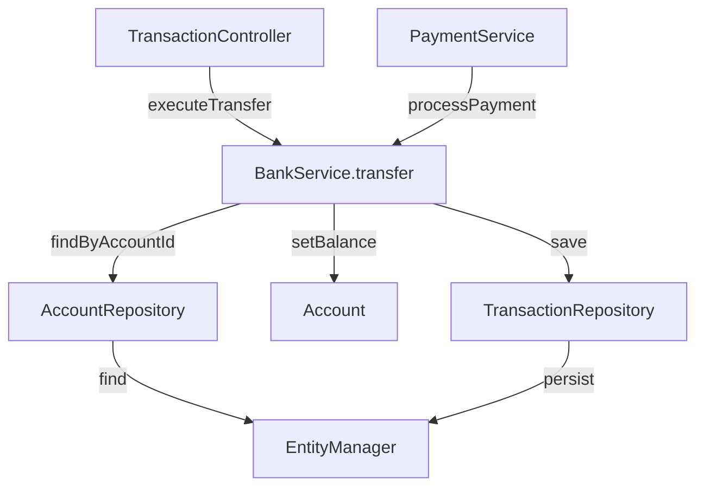

# 前端工具清单文档

**版本**: 1.0
**更新日期**: 2026-01-05
**维护者**: SiliconMan Team

---

## 📋 概述

本文档详细列出了 IDE 插件（前端）提供的所有工具，供 Claude Code 通过 WebSocket TOOL_CALL 消息调用。

### 工具分类

- **🔍 代码读取工具** (6个): read_class, read_method, text_search, list_dir, read_file, read_config
- **🔗 调用分析工具** (2个): call_chain, find_usages
- **✏️ 代码修改工具** (3个): write_file, modify_file, apply_change
- **📄 专用工具** (1个): read_xml (MyBatis SQL 提取)

---

## 🔍 代码读取工具

### 1. read_class - 读取类结构

**用途**: 读取 Java 类的完整结构信息（字段、方法、继承关系等）

**调用参数**:

```json
{
  "toolName": "read_class",
  "params": {
    "className": "com.bank.service.BankService",
    "mode": "structure"
  }
}
```

**参数说明**:

| 参数 | 类型 | 必需 | 说明 |
|------|------|------|------|
| className | String | ✅ | 完整类名（包含包路径） |
| mode | String | ⚠️ | 读取模式，默认 `structure` |

**读取模式**:

| 模式 | 说明 | 返回内容 |
|------|------|----------|
| `structure` | 类结构 | 类名、包名、父类、接口、字段、方法签名 |
| `full` | 完整代码 | 上述内容 + 方法完整实现 |
| `imports_fields` | 导入和字段 | 仅返回 import 语句和字段定义 |

**返回格式** (Markdown):

```markdown
## BankService.java

- **类名**: `BankService`
- **包名**: `com.bank.service`
- **父类**: `AbstractService`
- **接口**: `Serializable`, `Cloneable`

### 字段

```java
private String bankCode;
private AccountManager accountManager;
private List<Transaction> transactions;
```

### 方法

| 修饰符 | 返回类型 | 方法名 | 参数 |
|--------|----------|--------|------|
| public | Account | getAccount | String accountId |
| public | void | transfer | String from, String to, BigDecimal amount |
| private | boolean | validateAccount | String accountId |

### 继承关系

```
BankService extends AbstractService
AbstractService extends BaseService
```

### 接口实现

- `Serializable`
- `Cloneable`
```

**实现要点**:

```kotlin
private fun executeReadClass(parameters: Map<String, Any?>): ToolResult {
    val className = parameters["className"] as String
    val mode = parameters["mode"] as? String ?: "structure"

    // 1. 使用 PSI API 查找类
    val psiClass = findPsiClass(className)
        ?: return ToolResult(false, "未找到类: $className")

    // 2. 根据模式提取不同信息
    return when (mode) {
        "structure" -> extractClassStructure(psiClass)
        "full" -> extractFullClassCode(psiClass)
        "imports_fields" -> extractImportsAndFields(psiClass)
        else -> ToolResult(false, "不支持的 mode: $mode")
    }
}
```

---

### 2. read_method - 读取方法源码

**用途**: 读取指定方法的完整源代码（包括注释）

**调用参数**:

```json
{
  "toolName": "read_method",
  "params": {
    "className": "com.bank.service.BankService",
    "methodName": "transfer",
    "parameterTypes": ["java.lang.String", "java.lang.String", "java.math.BigDecimal"]
  }
}
```

**参数说明**:

| 参数 | 类型 | 必需 | 说明 |
|------|------|------|------|
| className | String | ✅ | 完整类名 |
| methodName | String | ✅ | 方法名 |
| parameterTypes | List<String> | ⚠️ | 参数类型列表（用于重载方法识别） |

**返回格式**:

```markdown
## BankService.transfer()

```java
/**
 * 转账操作
 *
 * @param from 源账户ID
 * @param to 目标账户ID
 * @param amount 转账金额
 * @throws InsufficientBalanceException 余额不足时抛出
 */
public void transfer(String from, String to, BigDecimal amount) {
    // 1. 验证账户
    Account fromAccount = accountRepository.findByAccountId(from);
    Account toAccount = accountRepository.findByAccountId(to);

    // 2. 检查余额
    if (fromAccount.getBalance().compareTo(amount) < 0) {
        throw new InsufficientBalanceException("余额不足");
    }

    // 3. 执行转账
    fromAccount.setBalance(fromAccount.getBalance().subtract(amount));
    toAccount.setBalance(toAccount.getBalance().add(amount));

    // 4. 保存交易记录
    Transaction transaction = new Transaction(from, to, amount);
    transactionRepository.save(transaction);
}
```

**调用链**:

- 被 `TransactionService.executeTransfer()` 调用
- 调用 `accountRepository.findByAccountId()`
- 调用 `transactionRepository.save()`
```

---

### 3. text_search - 文本搜索

**用途**: 在项目源码中搜索包含指定文本的文件（支持多模块项目）

**调用参数**:

```json
{
  "toolName": "text_search",
  "params": {
    "query": "文件读取 异常",
    "filePattern": "*.java",
    "maxResults": 20,
    "caseSensitive": false
  }
}
```

**参数说明**:

| 参数 | 类型 | 必需 | 说明 |
|------|------|------|------|
| query | String | ✅ | 搜索关键词（支持多个关键词，空格分隔） |
| filePattern | String | ⚠️ | 文件匹配模式，默认 `*.java` |
| maxResults | Number | ⚠️ | 最大结果数，默认 30 |
| caseSensitive | Boolean | ⚠️ | 是否区分大小写，默认 false |

**高级搜索模式**:

| 模式 | 示例 | 说明 |
|------|------|------|
| 单关键词 | `"文件读取"` | 搜索包含"文件读取"的文件 |
| 多关键词 | `"文件 读取 异常"` | 搜索同时包含这三个词的文件 |
| 正则表达式 | `regex:.*Exception.*` | 使用正则表达式匹配 |
| 排除模式 | `"文件" -"读取"` | 包含"文件"但不包含"读取" |

**返回格式**:

```markdown
## 搜索结果（找到 18 个文件）

### bank-core/src/main/java/com/bank/io/FileReader.java

**相关性**: 0.95
**文件大小**: 4.2 KB

```java
34: public String readFile(String path) throws FileReadException {
35:     // 文件读取逻辑
36:     try (BufferedReader reader = new BufferedReader(new FileReader(path))) {
...
45:     } catch (IOException e) {
46:         throw new FileReadException("文件读取异常", e);
47:     }
48: }
```

---

### payment-service/src/main/java/com/payment/processor/PaymentProcessor.java

**相关性**: 0.87
**文件大小**: 8.5 KB

```java
112: private void handleFileReadError(String filePath) {
113:     log.error("文件读取失败: {}", filePath);
114:     // 错误处理逻辑
115: }
```

---
*搜索耗时: 1.23 秒*
```

---

### 4. list_dir - 列出目录

**用途**: 列出目录内容（文件和子目录），支持递归

**调用参数**:

```json
{
  "toolName": "list_dir",
  "params": {
    "path": "bank-core/src/main/java/com/bank",
    "depth": 2,
    "includeFiles": true,
    "includeDirs": true,
    "pattern": "*Service*.java"
  }
}
```

**参数说明**:

| 参数 | 类型 | 必需 | 说明 |
|------|------|------|------|
| path | String | ✅ | 相对或绝对路径 |
| depth | Number | ⚠️ | 递归深度，默认 1（不递归） |
| includeFiles | Boolean | ⚠️ | 是否包含文件，默认 true |
| includeDirs | Boolean | ⚠️ | 是否包含目录，默认 true |
| pattern | String | ⚠️ | 文件名匹配模式（glob） |

**返回格式**:

```markdown
## 目录结构: bank-core/src/main/java/com/bank

### 📁 service (3 个文件, 2 个子目录)

```
bank-core/src/main/java/com/bank/service/
├── BankService.java (4.2 KB)
├── AccountService.java (3.8 KB)
├── TransactionService.java (5.1 KB)
├── impl/
│   ├── BankServiceImpl.java (6.2 KB)
│   └── AccountServiceImpl.java (5.5 KB)
└── model/
    ├── Account.java (2.1 KB)
    └── Transaction.java (1.8 KB)
```

### 文件列表

| 文件名 | 大小 | 类型 |
|--------|------|------|
| BankService.java | 4.2 KB | Java 源码 |
| AccountService.java | 3.8 KB | Java 源码 |
| TransactionService.java | 5.1 KB | Java 源码 |

### 子目录

| 目录名 | 文件数 | 总大小 |
|--------|--------|--------|
| impl | 2 | 11.7 KB |
| model | 2 | 3.9 KB |
```

---

### 5. read_file - 读取文件

**用途**: 读取任意文本文件内容（自动检测编码）

**调用参数**:

```json
{
  "toolName": "read_file",
  "params": {
    "path": "bank-core/src/main/resources/application.yml",
    "encoding": "UTF-8",
    "lineStart": 1,
    "lineEnd": 50
  }
}
```

**参数说明**:

| 参数 | 类型 | 必需 | 说明 |
|------|------|------|------|
| path | String | ✅ | 文件路径（相对于项目根目录） |
| encoding | String | ⚠️ | 文件编码，默认自动检测 |
| lineStart | Number | ⚠️ | 起始行号，默认 1 |
| lineEnd | Number | ⚠️ | 结束行号，默认文件末尾 |

**返回格式**:

```markdown
## application.yml (Lines 1-50)

```yaml
# Spring Boot 配置文件
server:
  port: 8080

spring:
  datasource:
    url: jdbc:mysql://localhost:3306/bank_core
    username: root
    password: ${DB_PASSWORD}
    driver-class-name: com.mysql.cj.jdbc.Driver

  jpa:
    hibernate:
      ddl-auto: update
    show-sql: true

logging:
  level:
    com.bank: DEBUG
    org.hibernate.SQL: DEBUG
```

**文件信息**:
- 大小: 2.1 KB
- 编码: UTF-8
- 总行数: 50
```

---

### 6. read_config - 读取配置文件

**用途**: 专门读取配置文件（yml/properties/xml），提供结构化解析

**调用参数**:

```json
{
  "toolName": "read_config",
  "params": {
    "path": "application.yml",
    "type": "yaml"
  }
}
```

**参数说明**:

| 参数 | 类型 | 必需 | 说明 |
|------|------|------|------|
| path | String | ✅ | 配置文件路径 |
| type | String | ⚠️ | 配置类型：`yaml`, `properties`, `xml`，默认自动检测 |

**返回格式** (YAML):

```markdown
## application.yml 配置

### 服务器配置

```yaml
server:
  port: 8080
  servlet:
    context-path: /api
```

### 数据源配置

```yaml
spring:
  datasource:
    url: jdbc:mysql://localhost:3306/bank_core
    username: root
    password: ${DB_PASSWORD}  # 环境变量
```

### 日志配置

```yaml
logging:
  level:
    com.bank: DEBUG
    org.hibernate.SQL: DEBUG
  file:
    name: logs/bank-core.log
```

### 环境变量

| 变量名 | 用途 | 默认值 |
|--------|------|--------|
| DB_PASSWORD | 数据库密码 | (未设置) |
```

---

## 🔗 调用分析工具

### 7. call_chain - 调用链分析

**用途**: 分析方法的调用关系（调用者和被调用者）

**调用参数**:

```json
{
  "toolName": "call_chain",
  "params": {
    "method": "com.bank.service.BankService.transfer",
    "direction": "both",
    "depth": 3,
    "includeInternal": true
  }
}
```

**参数说明**:

| 参数 | 类型 | 必需 | 说明 |
|------|------|------|------|
| method | String | ✅ | 完整方法签名（类名.方法名） |
| direction | String | ⚠️ | 方向：`callers`（调用者）, `callees`（被调用者）, `both`（双向） |
| depth | Number | ⚠️ | 深度，默认 2 |
| includeInternal | Boolean | ⚠️ | 是否包含 JDK 内部方法，默认 false |

**返回格式**:

```markdown
## BankService.transfer() 调用链分析

### 调用者 (Who calls this method?)

```
TransactionController.executeTransfer() (Line 45)
  └── BankService.transfer()

PaymentService.processPayment() (Line 78)
  └── BankService.transfer()
```

**调用者统计**: 2 个类，3 个方法

---

### 被调用者 (What does this method call?)

**直接调用** (Depth 1):

```
BankService.transfer()
  ├── AccountRepository.findByAccountId(String) (Line 67)
  ├── AccountRepository.findByAccountId(String) (Line 72)
  ├── Account.setBalance(BigDecimal) (Line 82)
  ├── Account.setBalance(BigDecimal) (Line 85)
  └── TransactionRepository.save(Transaction) (Line 91)
```

**间接调用** (Depth 2):

```
BankService.transfer()
  └── AccountRepository.findByAccountId()
      └── EntityManager.find()
          └── SessionImpl.get()
```

---

### 调用链图 (Mermaid)



---

### 统计信息

| 指标 | 数值 |
|------|------|
| 调用者数量 | 3 |
| 被调用者数量 | 5 |
| 最大深度 | 3 |
| 分析耗时 | 0.85 秒 |
```

---

### 8. find_usages - 查找引用

**用途**: 查找类、方法、字段的所有引用位置（结合调用链和文本搜索）

**调用参数**:

```json
{
  "toolName": "find_usages",
  "params": {
    "target": "com.bank.service.BankService.bankCode",
    "maxResults": 50
  }
}
```

**参数说明**:

| 参数 | 类型 | 必需 | 说明 |
|------|------|------|------|
| target | String | ✅ | 目标（类名.字段名 或 类名.方法名） |
| maxResults | Number | ⚠️ | 最大结果数，默认 30 |

**返回格式**:

```markdown
## BankService.bankCode 引用查找

**目标类型**: 字段
**声明位置**: `BankService.java:23`

---

### 直接引用 (5 处)

#### 1. BankService.getBankCode() (Line 31)
```java
return this.bankCode;
```
**类型**: 读取

---

#### 2. BankService.setBankCode(String) (Line 36)
```java
this.bankCode = bankCode;
```
**类型**: 写入

---

#### 3. BankService.validate() (Line 112)
```java
if (bankCode == null || bankCode.isEmpty()) {
    throw new ValidationException("bankCode 不能为空");
}
```
**类型**: 读取

---

### 文本匹配 (12 处)

#### 4. application.properties (Line 15)
```properties
bank.default.bankCode=BOCCN
```
**类型**: 配置文件

---

#### 5. BankServiceTest.java (Line 45)
```java
assertEquals("BOCCN", service.getBankCode());
```
**类型**: 测试代码

---

### 引用统计

| 类型 | 数量 |
|------|------|
| 直接引用 | 5 |
| 文本匹配 | 12 |
| 总计 | 17 |

### 引用分布

| 文件类型 | 数量 |
|----------|------|
| Java 源码 | 10 |
| 测试代码 | 4 |
| 配置文件 | 3 |

---
*查找耗时: 1.56 秒*
```

---

## ✏️ 代码修改工具

### 9. write_file - 写入文件

**用途**: 创建新文件或覆盖现有文件

**调用参数**:

```json
{
  "toolName": "write_file",
  "params": {
    "path": "bank-core/src/main/java/com/bank/dto/TransferRequest.java",
    "content": "package com.bank.dto;\n\npublic class TransferRequest {\n    private String from;\n    private String to;\n    private BigDecimal amount;\n    // getters and setters\n}"
  }
}
```

**参数说明**:

| 参数 | 类型 | 必需 | 说明 |
|------|------|------|------|
| path | String | ✅ | 文件路径（相对于项目根目录） |
| content | String | ✅ | 文件内容 |

**返回格式**:

```markdown
## ✅ 文件写入成功

**文件路径**: `bank-core/src/main/java/com/bank/dto/TransferRequest.java`
**文件大小**: 256 字节
**操作类型**: 创建新文件

---

### 预览

```java
package com.bank.dto;

public class TransferRequest {
    private String from;
    private String to;
    private BigDecimal amount;
    // getters and setters
}
```

---

**后续建议**:
- 添加 getter/setter 方法
- 添加参数校验注解 (`@NotNull`, `@Positive`)
- 考虑使用 Lombok 简化代码
```

---

### 10. modify_file - 修改文件

**用途**: 对现有文件进行结构化修改（替换、插入、删除、添加导入）

**调用参数**:

```json
{
  "toolName": "modify_file",
  "params": {
    "path": "bank-core/src/main/java/com/bank/service/BankService.java",
    "edits": [
      {
        "type": "replace",
        "searchContent": "private int maxRetries = 1;",
        "replaceContent": "private int maxRetries = 3;"
      },
      {
        "type": "insert",
        "after": "public void transfer(String from, String to, BigDecimal amount) {",
        "content": "        // 参数校验\n        if (amount.compareTo(BigDecimal.ZERO) <= 0) {\n            throw new IllegalArgumentException(\"转账金额必须大于0\");\n        }"
      },
      {
        "type": "add_import",
        "importStatement": "import com.bank.exceptions.InsufficientBalanceException;"
      }
    ]
  }
}
```

**参数说明**:

| 参数 | 类型 | 必需 | 说明 |
|------|------|------|------|
| path | String | ✅ | 文件路径 |
| edits | Array | ✅ | 编辑操作列表 |

**编辑类型 (edit.type)**:

| 类型 | 说明 | 必需参数 |
|------|------|----------|
| `replace` | 替换匹配的文本 | `searchContent`, `replaceContent` |
| `insert` | 在指定位置后插入 | `after`, `content` |
| `delete` | 删除匹配的文本 | `searchContent` |
| `add_import` | 添加 import 语句 | `importStatement` |

**返回格式**:

```markdown
## ✅ 文件修改成功 (3 个操作)

**文件路径**: `bank-core/src/main/java/com/bank/service/BankService.java`

---

### 操作详情

#### 1. ✅ 替换成功

**位置**: Line 23
**修改前**:
```java
private int maxRetries = 1;
```
**修改后**:
```java
private int maxRetries = 3;
```

---

#### 2. ✅ 插入成功

**位置**: Line 45 (after `public void transfer(...) {`)
**插入内容**:
```java
        // 参数校验
        if (amount.compareTo(BigDecimal.ZERO) <= 0) {
            throw new IllegalArgumentException("转账金额必须大于0");
        }
```

---

#### 3. ✅ 添加导入成功

**添加内容**:
```java
import com.bank.exceptions.InsufficientBalanceException;
```

---

### 建议后续操作

1. 运行单元测试验证修改
2. 检查是否影响调用方代码
3. 更新相关文档

---
*修改耗时: 0.45 秒*
```

---

### 11. apply_change - 应用修改（SEARCH/REPLACE 格式）

**用途**: 类似 Claude Code 的 SEARCH/REPLACE 格式，支持自动格式化

**调用参数**:

```json
{
  "toolName": "apply_change",
  "params": {
    "relativePath": "bank-core/src/main/java/com/bank/service/BankService.java",
    "searchContent": "    public void transfer(String from, String to, BigDecimal amount) {\n        Account fromAccount = accountRepository.findByAccountId(from);\n        Account toAccount = accountRepository.findByAccountId(to);\n\n        if (fromAccount.getBalance().compareTo(amount) < 0) {\n            throw new InsufficientBalanceException(\"余额不足\");\n        }\n\n        fromAccount.setBalance(fromAccount.getBalance().subtract(amount));\n        toAccount.setBalance(toAccount.getBalance().add(amount));\n\n        transactionRepository.save(new Transaction(from, to, amount));\n    }",
    "replaceContent": "    public void transfer(String from, String to, BigDecimal amount) {\n        // 1. 参数校验\n        validateTransferParams(from, to, amount);\n\n        // 2. 查询账户\n        Account fromAccount = accountRepository.findByAccountId(from);\n        Account toAccount = accountRepository.findByAccountId(to);\n\n        // 3. 余额检查\n        if (fromAccount.getBalance().compareTo(amount) < 0) {\n            throw new InsufficientBalanceException(\"余额不足\");\n        }\n\n        // 4. 执行转账\n        fromAccount.setBalance(fromAccount.getBalance().subtract(amount));\n        toAccount.setBalance(toAccount.getBalance().add(amount));\n\n        // 5. 保存交易记录\n        transactionRepository.save(new Transaction(from, to, amount));\n\n        // 6. 发送通知\n        notificationService.sendTransferNotification(from, to, amount);\n    }\n\n    private void validateTransferParams(String from, String to, BigDecimal amount) {\n        if (from == null || to == null || from.equals(to)) {\n            throw new IllegalArgumentException(\"账户参数无效\");\n        }\n        if (amount == null || amount.compareTo(BigDecimal.ZERO) <= 0) {\n            throw new IllegalArgumentException(\"转账金额必须大于0\");\n        }\n    }",
    "description": "重构 transfer 方法，提取参数校验逻辑，添加通知功能"
  }
}
```

**参数说明**:

| 参数 | 类型 | 必需 | 说明 |
|------|------|------|------|
| relativePath | String | ✅ | 相对路径（相对于项目根目录） |
| searchContent | String | ✅ | 搜索内容（精确匹配，包括空格和缩进） |
| replaceContent | String | ✅ | 替换内容 |
| description | String | ⚠️ | 修改描述（用于日志记录） |

**特性**:
- ✅ **自动格式化**: 修改后自动调用 IDEA 的格式化功能
- ✅ **精确匹配**: 必须完全匹配 `searchContent`（包括空格）
- ✅ **冲突检测**: 如果 `searchContent` 不匹配，返回错误
- ✅ **撤销支持**: 修改记录在 IDEA 的 Local History 中

**返回格式**:

```markdown
## ✅ 代码修改成功

**文件**: `bank-core/src/main/java/com/bank/service/BankService.java`
**描述**: 重构 transfer 方法，提取参数校验逻辑，添加通知功能

---

### 修改内容

**搜索范围** (Lines 45-57):
```java
public void transfer(String from, String to, BigDecimal amount) {
    Account fromAccount = accountRepository.findByAccountId(from);
    Account toAccount = accountRepository.findByAccountId(to);

    if (fromAccount.getBalance().compareTo(amount) < 0) {
        throw new InsufficientBalanceException("余额不足");
    }

    fromAccount.setBalance(fromAccount.getBalance().subtract(amount));
    toAccount.setBalance(toAccount.getBalance().add(amount));

    transactionRepository.save(new Transaction(from, to, amount));
}
```

**替换为** (Lines 45-75):
```java
public void transfer(String from, String to, BigDecimal amount) {
    // 1. 参数校验
    validateTransferParams(from, to, amount);

    // 2. 查询账户
    Account fromAccount = accountRepository.findByAccountId(from);
    Account toAccount = accountRepository.findByAccountId(to);

    // 3. 余额检查
    if (fromAccount.getBalance().compareTo(amount) < 0) {
        throw new InsufficientBalanceException("余额不足");
    }

    // 4. 执行转账
    fromAccount.setBalance(fromAccount.getBalance().subtract(amount));
    toAccount.setBalance(toAccount.getBalance().add(amount));

    // 5. 保存交易记录
    transactionRepository.save(new Transaction(from, to, amount));

    // 6. 发送通知
    notificationService.sendTransferNotification(from, to, amount);
}

private void validateTransferParams(String from, String to, BigDecimal amount) {
    if (from == null || to == null || from.equals(to)) {
        throw new IllegalArgumentException("账户参数无效");
    }
    if (amount == null || amount.compareTo(BigDecimal.ZERO) <= 0) {
        throw new IllegalArgumentException("转账金额必须大于0");
    }
}
```

---

### 影响分析

**变更行数**: +18 行 (从 13 行增加到 31 行)

**新增方法**:
- `validateTransferParams(String, String, BigDecimal)` - 参数校验逻辑

**新增依赖**:
- `notificationService` - 需要注入 `NotificationService`

---

### 后续建议

1. ⚠️ **需要注入依赖**: 在类中添加 `NotificationService` 的注入
2. 🧪 **编写测试**: 为 `validateTransferParams` 方法编写单元测试
3. 📝 **更新文档**: 更新 API 文档，说明新增的通知功能
4. ✅ **运行测试**: 执行 `BankServiceTest` 验证修改

---

### 操作时间线

| 时间 | 操作 |
|------|------|
| 0.00s | 开始搜索 |
| 0.02s | 找到匹配位置 (Line 45) |
| 0.05s | 应用修改 |
| 0.08s | 自动格式化 |
| 0.12s | 完成 |

---
*总耗时: 0.12 秒*
```

---

## 📄 专用工具

### 12. read_xml - 读取 XML（MyBatis SQL 提取）

**用途**: 读取 XML 文件，支持自动提取 MyBatis Mapper 的 SQL 语句

**调用参数**:

```json
{
  "toolName": "read_xml",
  "params": {
    "path": "bank-core/src/main/resources/mappers/BankMapper.xml",
    "extractSql": true,
    "formatSql": true
  }
}
```

**参数说明**:

| 参数 | 类型 | 必需 | 说明 |
|------|------|------|------|
| path | String | ✅ | XML 文件路径 |
| extractSql | Boolean | ⚠️ | 是否提取 MyBatis SQL，默认 false |
| formatSql | Boolean | ⚠️ | 是否格式化 SQL，默认 true |

**返回格式**:

```markdown
## BankMapper.xml

### 基本信息

- **命名空间**: `com.bank.repository.BankMapper`
- **文件大小**: 3.2 KB
- **Mapper 数量**: 4 个

---

### Mapper 方法

#### 1. findBankByCode

```xml
<select id="findBankByCode" resultType="Bank">
    SELECT
        bank_id,
        bank_code,
        bank_name,
        address,
        created_at
    FROM
        bank
    WHERE
        bank_code = #{bankCode}
</select>
```

**SQL (格式化)**:
```sql
SELECT
    bank_id,
    bank_code,
    bank_name,
    address,
    created_at
FROM
    bank
WHERE
    bank_code = #{bankCode}
```

**参数**: `bankCode` (String)
**返回类型**: `Bank`

---

#### 2. insertBank

```xml
<insert id="insertBank" parameterType="Bank" useGeneratedKeys="true" keyProperty="bankId">
    INSERT INTO bank (
        bank_code,
        bank_name,
        address,
        created_at
    ) VALUES (
        #{bankCode},
        #{bankName},
        #{address},
        NOW()
    )
</insert>
```

**SQL (格式化)**:
```sql
INSERT INTO bank (
    bank_code,
    bank_name,
    address,
    created_at
) VALUES (
    #{bankCode},
    #{bankName},
    #{address},
    NOW()
)
```

**参数**: `Bank` 对象
**返回**: 自增主键值

---

### 完整 XML 源码

```xml
<?xml version="1.0" encoding="UTF-8" ?>
<!DOCTYPE mapper PUBLIC "-//mybatis.org//DTD Mapper 3.0//EN"
    "http://mybatis.org/dtd/mybatis-3-mapper.dtd">

<mapper namespace="com.bank.repository.BankMapper">

    <resultMap id="bankResultMap" type="Bank">
        <id property="bankId" column="bank_id"/>
        <result property="bankCode" column="bank_code"/>
        <result property="bankName" column="bank_name"/>
        <result property="address" column="address"/>
        <result property="createdAt" column="created_at"/>
    </resultMap>

    <select id="findBankByCode" resultMap="bankResultMap">
        SELECT bank_id, bank_code, bank_name, address, created_at
        FROM bank
        WHERE bank_code = #{bankCode}
    </select>

    <!-- 其他 mappers... -->

</mapper>
```
```

---

## 🎯 工具选择指南

### 常见场景推荐工具

| 场景 | 推荐工具 | 替代工具 |
|------|----------|----------|
| 了解类结构 | `read_class` (mode=structure) | - |
| 阅读方法实现 | `read_method` | `read_class` (mode=full) |
| 搜索关键词 | `text_search` | - |
| 查找调用关系 | `call_chain` | `find_usages` |
| 查找引用位置 | `find_usages` | `call_chain` |
| 创建新文件 | `write_file` | - |
| 修改现有代码 | `apply_change` | `modify_file` |
| 复杂修改（多次操作） | `modify_file` | - |
| 读取配置 | `read_config` | `read_file` |
| 浏览目录 | `list_dir` | - |
| 分析 MyBatis SQL | `read_xml` (extractSql=true) | `read_file` |

---

## ⚙️ 实现细节

### 工具执行器架构

```kotlin
object LocalToolExecutor {

    fun execute(toolName: String, parameters: Map<String, Any?>, projectPath: String?): ToolResult {
        val startTime = System.currentTimeMillis()

        return try {
            val result = when (toolName) {
                "read_class" -> executeReadClass(parameters)
                "read_method" -> executeReadMethod(parameters)
                "text_search" -> executeTextSearch(parameters, projectPath)
                "list_dir" -> executeListDir(parameters, projectPath)
                "read_xml" -> executeReadXml(parameters, projectPath)
                "read_file" -> executeReadFile(parameters, projectPath, null)
                "read_config" -> executeReadConfig(parameters, projectPath)
                "call_chain" -> executeCallChain(parameters)
                "find_usages" -> executeFindUsages(parameters, projectPath)
                "write_file" -> executeWriteFile(parameters, projectPath)
                "modify_file" -> executeModifyFile(parameters, projectPath)
                "apply_change" -> executeApplyChange(parameters, projectPath)
                else -> ToolResult(false, "不支持的工具: $toolName")
            }

            val elapsed = System.currentTimeMillis() - startTime
            result.copy(executionTime = elapsed)

        } catch (e: Exception) {
            ToolResult(false, "工具执行异常: ${e.message}", 0)
        }
    }
}
```

### 错误处理

所有工具返回统一的 `ToolResult` 格式：

```kotlin
data class ToolResult(
    val success: Boolean,
    val result: String?,
    val executionTime: Long,
    val error: String? = null
)
```

**错误响应示例**:

```json
{
  "type": "TOOL_RESULT",
  "data": {
    "toolCallId": "tc-550e8400",
    "success": false,
    "result": null,
    "error": "未找到类: com.bank.NonExistentClass",
    "executionTime": 45
  }
}
```

---

## 🔧 性能优化

### 缓存策略

| 工具 | 缓存策略 | 缓存时间 |
|------|----------|----------|
| read_class | 内存缓存（类结构不常变） | 10 分钟 |
| read_method | 内存缓存 | 10 分钟 |
| call_chain | 内存缓存 | 5 分钟 |
| text_search | 无缓存（每次搜索） | - |
| find_usages | 无缓存 | - |

### 并发控制

- **工具执行线程池**: 固定 10 个线程
- **超时控制**: 单个工具最长执行 30 秒
- **资源限制**: 同时最多 5 个 `text_search` 操作

---

## 📚 相关文档

- [WebSocket API v2](./05-websocket-api-v2.md) - TOOL_CALL 消息格式
- [Claude Code 集成](./03-claude-code-integration.md) - Claude Code 如何调用这些工具
- [降级策略](./07-fallback-strategy.md) - 本地模式下的工具调用

---

**文档版本历史**:

| 版本 | 日期 | 变更说明 |
|------|------|----------|
| 1.0 | 2026-01-05 | 初始版本，列出所有 12 个前端工具 |
