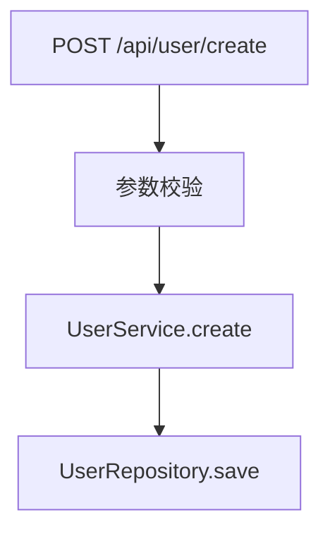

# Java 项目分析 Skill 套件

一套 Claude Code / OpenClaw 使用的 Java 项目分析工具。

## 核心理念：元 Skill + 动态自我发现

### 什么是元 Skill？

这些 Skill 是**元 Skill（Meta Skill）**，不是静态的扫描脚本，而是**扫描指导原则**。

**工作原理：**
1. **边扫描边学习** - 在扫描过程中发现项目特有的模式、约定、命名规范
2. **有价值的发现写入项目 Skill** - 将发现的项目专属入口、约定、模式记录下来
3. **生成项目专属 Skill** - 最终形成针对该项目的专属 Skill，后续遇到相关需求可快速响应

### 示例流程

```
第一次扫描项目：
┌─────────────────────────────────────────────────────────┐
│ 元 Skill: java-api-scanner                              │
│ ─────────────────────────────────────────────────────── │
│ 扫描规则：                                               │
│ - 从注解入手：@RestController、@Path...                  │
│ - 从类名入手：*Controller、*Handler...                   │
│ - 从包名入手：*.controller.*、*.api.*...                 │
│ - 从继承关系入手：extends HttpServlet...                 │
│                                                         │
│ 边扫描边发现：                                           │
│ ✓ 发现项目使用自研 RPC 框架 @SoaService                  │
│ ✓ 发现项目有统一的 BaseApiController 基类                │
│ ✓ 发现项目 API 统一在 com.xxx.openapi 包下              │
│ ✓ 发现项目使用 XXL-Job 定时任务暴露接口                  │
└─────────────────────────────────────────────────────────┘
                          ↓
┌─────────────────────────────────────────────────────────┐
│ 生成项目专属 Skill: project-api-entry.md                │
│ ─────────────────────────────────────────────────────── │
│ ## 该项目的 API 入口                                     │
│                                                         │
│ ### 自研框架                                            │
│ - @SoaService - 公司内部 RPC 框架                       │
│   - 位置：com.xxx.soa.*                                 │
│   - 示例：UserSoaService.java                           │
│                                                         │
│ ### HTTP API                                           │
│ - 所有 Controller 继承 BaseApiController                │
│ - 统一路径前缀：/api/v1                                  │
│ - 位置：com.xxx.openapi.controller.*                    │
│                                                         │
│ ### 定时任务                                            │
│ - @XxlJob 标注的方法                                    │
│ - 位置：com.xxx.job.*                                   │
└─────────────────────────────────────────────────────────┘
```

### 价值

| 场景 | 没有 项目 Skill | 有 项目 Skill |
|------|----------------|---------------|
| "找到用户注册入口" | 重新扫描整个项目 | 直接定位 UserSoaService.register() |
| "这个接口调用了哪个服务" | 搜索代码 | 查看 Skill 已记录的调用关系 |
| "新增一个类似接口" | 研究现有代码 | 参考 Skill 中的约定和模式 |

## 重要：Token 限制与分批执行

> **LLM 上下文窗口有限，存量 Java 项目类成千上万，必须分批执行！**

### 核心原则

1. **分批扫描** - 每次只扫描一个模块/包/类型，不要试图一次扫描整个项目
2. **增量记录** - 每批扫描完立即写入项目 Skill，不要等全部完成
3. **归纳跳过** - 发现大量重复模式时，归纳后跳过，不要逐个处理

### 分批策略示例

```
java-api-scanner 分批执行：
├── 第1轮：扫描 @RestController 注解类 → 记录到 project-api-entry.md
├── 第2轮：扫描 @Path 注解类 → 追加到 project-api-entry.md
├── 第3轮：扫描 *Controller 命名类 → 追加到 project-api-entry.md
├── 第4轮：扫描 *.controller.* 包下类 → 追加到 project-api-entry.md
└── ...以此类推

java-arch-scanner 分批执行：
├── 第1轮：分析根 pom.xml → 记录模块列表和依赖版本
├── 第2轮：分析 application.yml → 记录关键配置
└── 第3轮：扫描各模块包结构 → 记录分层约定
```

### Token 估算参考

| 扫描对象 | 单位 Token 消耗 | 建议每批上限 |
|----------|----------------|--------------|
| Controller 类 | 500-1000 tokens | 30-50 个类 |
| Entity 类 | 300-800 tokens | 40-60 个类 |
| 配置文件 | 200-500 tokens | 5-10 个文件 |
| pom.xml | 1000-3000 tokens | 1-2 个文件 |

### 遇到以下情况立即停止并记录

- 上下文接近窗口限制（预留 20% 给输出）
- 发现大量重复模式（可归纳后跳过）
- 发现项目特有框架（先记录框架信息，再针对性扫描）

## 快速开始

把这8个 skill 复制到你的 skills 目录，然后就可以用了。

## Skill 清单

| Skill | 作用 | 适用场景 |
|-------|------|----------|
| `java-arch-scanner` | 项目架构扫描 | 接手新项目，了解整体结构 |
| `java-api-scanner` | API 接口扫描 | 找所有对外接口 |
| `java-external-call-scanner` | 外调接口扫描 | 找对外部的调用 |
| `java-entity-scanner` | 数据库实体扫描 | 理解业务数据和关系 |
| `java-enum-scanner` | 枚举类扫描 | 理解业务状态和常量 |
| `java-common-class-scanner` | 公共类扫描 | 找工具类、通用组件 |
| `java-config-scanner` | 配置文件扫描 | 了解配置和环境差异 |
| `java-flow-analyzer` | 接口业务流程分析 | 深度理解某个接口的业务流程 |

## 使用方式

### 场景1：接手新项目
```
你: 分析一下这个项目的架构
→ 调用 java-arch-scanner
→ 了解模块、技术栈、包结构

你: 有哪些API接口？
→ 调用 java-api-scanner
→ 获取完整接口清单
```

### 场景2：排查问题
```
你: 用户注册流程是怎么走的？
→ 调用 java-flow-analyzer
→ 输入: /api/user/register, POST
→ 获取完整的业务流程图
```

### 场景3：理解数据
```
这个业务有哪些实体？它们之间什么关系？
→ 调用 java-entity-scanner
→ 获取 ER 图

有哪些状态？什么含义？
→ 调用 java-enum-scanner
→ 获取枚举清单
```

## 输出示例

### java-arch-scanner 输出
```
## 项目概览
- 构建工具: Maven
- 项目类型: 多模块
- 主要框架: Spring Boot 2.7.18, MyBatis Plus 3.5.3

## 模块结构
| 模块名 | 路径 | 职责 |
|--------|------|------|
| core | /core | 核心通用 |
| user | /user-service | 用户服务 |
```

### java-flow-analyzer 输出


## 建议

1. **先用 `java-arch-scanner`** - 了解全貌
2. **再用具体的扫描器** - 针对性获取
3. **深度分析用 `java-flow-analyzer`** - 需要指定接口

## 目录结构

```
java-scanner/
├── java-arch-scanner/
│   └── SKILL.md
├── java-api-scanner/
│   └── SKILL.md
├── java-external-call-scanner/
│   └── SKILL.md
├── java-entity-scanner/
│   └── SKILL.md
├── java-enum-scanner/
│   └── SKILL.md
├── java-common-class-scanner/
│   └── SKILL.md
├── java-config-scanner/
│   └── SKILL.md
└── java-flow-analyzer/
    └── SKILL.md
```

## 注意事项

- 所有 skill 基于静态代码分析
- 大项目可能需要较长时间
- 建议在项目中打开 `src/main/java` 目录后再调用
- 业务流程分析需要手动指定接口
