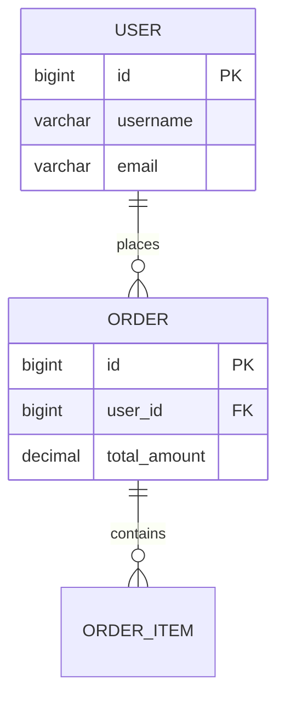

# Java Entity 实体扫描器（元 Skill）

> **这是元 Skill**：提供扫描指导原则，边扫描边学习，发现项目特有模式后生成项目专属 Skill。

## 作用
扫描项目中的数据库实体类，分析业务实体及其关系。

## 目标
找出所有 JPA/Hibernate 实体，输出实体清单和 ER 关系图。

## 边扫描边学习（重要！）

扫描过程中，**发现任何项目特有的模式都要记录**：

### 需要关注的发现
1. **实体基类** - 如 `BaseEntity`、`AbstractEntity` 包含哪些公共字段
2. **命名约定** - 表名前缀、字段命名风格
3. **软删除实现** - 如何实现逻辑删除
4. **审计字段** - 创建时间、更新时间等如何处理
5. **枚举字段处理** - 枚举在数据库中的存储方式
6. **自定义类型转换** - 如 JSON 字段、自定义 TypeHandler

### 发现后立即写入项目 Skill
在项目目录下创建或更新 `project-data-model.md`，记录：
- 该项目的实体基类和公共字段
- 表命名和字段命名约定
- 核心业务实体及其关系
- 特殊字段处理方式

## 执行策略（避免 Token 爆炸）

> **重要**：存量 Java 项目类成千上万，LLM 上下文窗口有限，必须分批执行！

### 分批扫描原则
1. **按模块分批** - 每次只扫描一个模块的实体
2. **按包分批** - 每次只扫描 `*.entity.*` 或 `*.domain.*` 包
3. **增量记录** - 每批扫描完立即写入项目 Skill

### 推荐执行方式
```
第1轮：扫描 @Entity 注解类 → 记录实体清单
第2轮：分析实体基类 → 记录公共字段
第3轮：分析实体关系 → 记录 ER 图
第4轮：分析特殊字段处理 → 记录 TypeHandler 等
...以此类推
```

### 优先级
1. 先找实体基类 - 了解公共字段
2. 再找核心业务实体 - User、Order 等
3. 最后找关联关系

## 扫描规则

### 1. 查找实体类
扫描以下注解：
- `@Entity`
- `@Table`
- `@MappedSuperclass`
- JPA 2.x 的 `@IdClass`、`@EmbeddedId`

### 2. 提取实体信息
- 类名（去除 Entity 后缀）
- 表名（@Table(name="xxx")）
- 主键（@Id、@GeneratedValue、@EmbeddedId）
- 字段和列映射

### 3. 识别关系
扫描以下注解：
- `@OneToOne`、`@OneToMany`
- `@ManyToOne`、`@ManyToMany`
- `@JoinColumn`、`@JoinTable`
- 记录关系方向（双向/单向）

### 4. 字段类型
- 基本类型
- 枚举（@Enumerated）
- 嵌套对象（@Embedded）
- 集合类型（List、Set、Map）

### 5. 排除规则
- 排除 JPA 内部的 EntityManager 等
- 排除 test 目录

## 输出格式

```markdown
## 实体清单

| 序号 | 实体类 | 表名 | 主键类型 | 字段数 | 所在文件 |
|------|--------|------|----------|--------|----------|
| 1 | User | t_user | Long | 15 | UserEntity.java |
| 2 | Order | t_order | Long | 22 | OrderEntity.java |
| 3 | OrderItem | t_order_item | Long | 18 | OrderItemEntity.java |

## 实体关系图 (Mermaid)



## 详细关系

### User -> Order (一对多)
- 关系: OneToMany
- 属性: orders
- 位于: UserEntity.java:45

### Order -> User (多对一)
- 关系: ManyToOne
- 属性: user
- 位于: OrderEntity.java:38
```

## 注意事项
- 表名优先用 @Table，没有则用类名转蛇形
- 主键类型要记录（Long、String、复合主键）
- 关系要成对展示（双向关系只写一次）
- 大项目按模块分组输出
