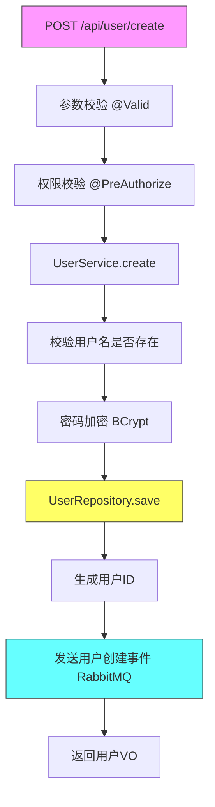

# Java 接口业务流程分析器（元 Skill）

> **这是元 Skill**：提供扫描指导原则，边扫描边学习，发现项目特有模式后生成项目专属 Skill。

## 作用
针对特定接口进行深度代码走读，生成业务流程图和详细说明。

## 目标
选定一个接口，完整追踪其代码调用链，生成流程图和业务说明。

## 边扫描边学习（重要！）

分析过程中，**发现任何项目特有的模式都要记录**：

### 需要关注的发现
1. **分层调用约定** - Controller → Service → Repository 的标准流程
2. **事务处理方式** - 事务边界、传播行为约定
3. **异常处理机制** - 统一异常处理、错误码返回
4. **日志埋点规范** - 关键节点的日志记录方式
5. **参数校验方式** - JSR-303 校验、自定义校验
6. **缓存使用模式** - 缓存 key 设计、失效策略

### 发现后立即写入项目 Skill
在项目目录下创建或更新 `project-coding-guide.md`，记录：
- 该项目的分层调用约定
- 事务和异常处理规范
- 日志和监控埋点规范
- 典型接口实现模板

## 执行策略（避免 Token 爆炸）

> **重要**：存量 Java 项目类成千上万，LLM 上下文窗口有限，必须分批执行！

### 分批分析原则
1. **按调用层级分批** - Controller → Service → Repository，逐层分析
2. **按深度控制** - 默认追踪 3 层，避免无限递归
3. **增量记录** - 每层分析完立即写入项目 Skill

### 推荐执行方式
```
第1轮：定位 Controller 入口 → 记录入口信息
第2轮：分析 Controller → Service 调用 → 记录业务逻辑
第3轮：分析 Service → Repository 调用 → 记录数据操作
第4轮：分析外部调用 → 记录 RPC/HTTP 调用
...以此类推
```

### 深度控制策略
- **第1层**：Controller 方法（入口）
- **第2层**：Service 方法（业务逻辑）
- **第3层**：Repository/外部调用（数据/外部）
- **超过3层**：用注释标注"深层调用"，不展开

### 遇到以下情况停止展开
- 调用 JDK/第三方库方法
- 调用已记录的公共组件
- 递归调用（标注"递归"）
- 异步调用（标注"异步"，单独分析）

## 使用方式

### 输入
需要指定：
1. 接口路径，如 `/api/user/create`
2. HTTP 方法，如 `POST`

### 或者
指定 Controller 类名 + 方法名

## 分析步骤

### 1. 定位入口
找到 Controller 方法，记录：
- 所在文件: XxxController.java
- 行号
- 方法签名
- 参数列表
- 请求/响应 DTO

### 2. 追踪调用链
按顺序追踪：

#### Controller 层
- 参数校验 (@Valid、@NotNull 等)
- 权限校验 (@PreAuthorize)
- 日志记录

#### Service 层
- 业务逻辑处理
- 事务边界 (@Transactional)
- 调用其他 Service
- 外部 RPC 调用

#### Repository 层
- 数据库操作
- 查询条件构建

#### 外部调用
- Feign 调用其他服务
- HTTP 调用第三方 API
- 消息发送 (RabbitMQ、Kafka)

### 3. 识别关键点
- 数据库操作 (CRUD)
- 事务边界
- 缓存使用 (Redis)
- 消息队列
- 异步处理
- 异常处理
- 日志埋点

### 4. 提取业务实体
追踪涉及的实体：
- 请求参数 DTO
- 查询/更新的 Entity
- 返回的 VO/DTO

## 输出格式

```markdown
## 接口: POST /api/user/create

### 基本信息
| 项目 | 内容 |
|------|------|
| 接口路径 | /api/user/create |
| HTTP方法 | POST |
| 所在类 | UserController.java:45 |
| 所属模块 | user-service |

### 请求参数
```java
@PostMapping("/create")
public Result<UserVO> create(@RequestBody @Valid UserCreateDTO dto) {
    // ...
}
```

### 业务流程图 (Mermaid)



### 调用链详情

| 层级 | 方法 | 文件:行号 | 说明 |
|------|------|-----------|------|
| Controller | create() | UserController.java:45 | 入口 |
| → | validate(dto) | - | @Valid触发 |
| Service | userService.create() | UserService.java:78 | 业务处理 |
| → | checkUsernameUnique() | UserService.java:82 | 唯一性校验 |
| → | passwordEncoder.encode() | PasswordEncoder.java:20 | 密码加密 |
| Repository | userRepository.save() | UserRepository.java:15 | 持久化 |
| Event | applicationEventPublisher.publish() | UserService.java:95 | 发送事件 |

### 涉及实体

| 类型 | 名称 | 说明 |
|------|------|------|
| DTO | UserCreateDTO | 请求参数 |
| Entity | User | 用户实体 |
| VO | UserVO | 响应结果 |
| Event | UserCreatedEvent | 用户创建事件 |

### 数据库操作

| 操作 | 表名 | 字段 |
|------|------|------|
| INSERT | t_user | username, password, email, mobile, status, create_time |

### 外部调用

| 目标 | 类型 | 接口 | 用途 |
|------|------|------|------|
| RabbitMQ | 消息队列 | user.created.exchange | 发送用户创建事件 |

### 异常处理

| 异常 | 状态码 | 场景 |
|------|--------|------|
| UserExistException | 400 | 用户名已存在 |
| ValidationException | 400 | 参数校验失败 |

### 事务配置
- 传播行为: REQUIRED
- 隔离级别: DEFAULT
- 只读: false
```

## 注意事项

### 手动输入接口信息
用户需要指定要分析的具体接口（路径+方法，或类名+方法名）

### 追踪深度
- 默认追踪 3 层调用
- 可根据需要调整（设置 maxDepth）

### 循环处理
- 循环只展示第一次迭代
- 用注释标注循环次数

### 异步处理
- 异步任务用虚线箭头标注
- 记录线程池配置

### 外部服务
- 标注服务间调用
- 记录超时、重试配置
